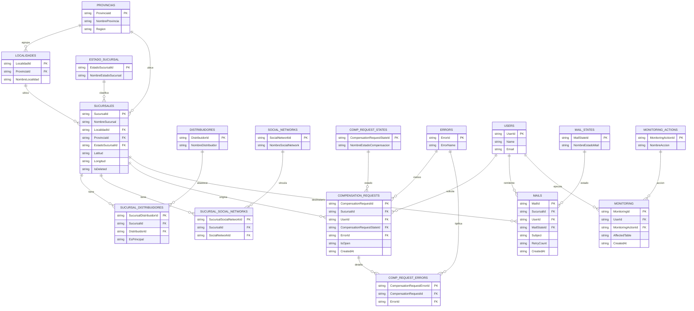

# Modelo de datos

El origen de datos son CSVs en [`src/assets/data`](../src/assets/data) que reproducen
tablas de una base relacional (SQL Server). La app carga **15** de esas tablas y construye
índices `id → nombre` en memoria (`buildLookups`). Todos los campos llegan como `string`
(el parse no infiere tipos); los flags booleanos vienen serializados como `'1'`/`''`
(ver `isFlag` en [`domain.constants.ts`](../src/app/models/domain.constants.ts)).

> Convención de claves en el diagrama: **PK** clave primaria, **FK** clave foránea.

## Diagrama entidad-relación

## Tablas cargadas por la app (15)

| Tabla CSV | Entidad / interfaz | Rol en el dashboard |
|-----------|--------------------|---------------------|
| `sucursales.csv` | `Sucursal` | Entidad central. Estado, coordenadas, fecha de apertura, soft-delete. |
| `provincias.csv` | `Provincia` | Dimensión geográfica (incluye `Region`). |
| `localidades.csv` | `Localidad` | Dimensión geográfica fina. |
| `estado_sucursal.csv` | `EstadoSucursal` | Catálogo Activa/Inactiva/Pendiente. |
| `distribuidores.csv` | `Distribuidor` | Catálogo de distribuidores. |
| `sucursal_distribuidores.csv` | `SucursalDistribuidor` | N:M sucursal↔distribuidor → cobertura distribuidor. |
| `sucursal_social_networks.csv` | `SucursalSocialNetwork` | N:M sucursal↔red social → cobertura social. |
| `compensation_requests.csv` | `CompensationRequest` | Compensaciones (abiertas/cerradas, estado, aging). |
| `compensation_request_states.csv` | `CompensationRequestState` | Catálogo Pending/InReview/Approved/Rejected. |
| `compensation_request_errors.csv` | `CompensationRequestError` | Errores asociados a compensaciones. |
| `errors.csv` | `Error` | Catálogo de tipos de error. |
| `mails.csv` | `Mail` | Emails de verificación (estado, reintentos). |
| `mail_states.csv` | `MailState` | Catálogo Sent/Failed. |
| `monitoring.csv` | `Monitoring` | Eventos de auditoría (tabla afectada, acción). |
| `monitoring_actions.csv` | `MonitoringAction` | Catálogo Insert/Update/SoftDelete/Bulk…/Delete. |

## Tablas presentes pero **no** cargadas

Estos CSVs existen en `assets/data` y son referenciados por claves foráneas, pero la app
**no los carga** hoy (las páginas no necesitan su detalle):

- `users.csv` — referenciado por `compensation_requests.UserId`, `mails.UserId`,
  `monitoring.UserId`. Hoy solo se usa el id, no el nombre del usuario.
- `social_networks.csv` — referenciado por `sucursal_social_networks.SocialNetworkId`.
  Para la cobertura social basta con saber **si existe** el vínculo, no de qué red se trata.
- `distribuidor_social_networks.csv`, `compensation_request_fields.csv`,
  `compensation_request_field_states.csv`, `dim_date.csv` — no participan de las vistas actuales.

> Si una vista futura necesita el nombre del usuario o el tipo de red social, basta con
> agregar la carga del CSV en `loadAllCsv()` y un lookup en `buildLookups()`. La lógica
> de agregación ya sigue ese patrón para el resto de las dimensiones.

## Notas de modelado relevantes para el cálculo

- **Coordenadas**: `Latitud`/`Longitud` son texto; pueden faltar o caer fuera de Argentina.
  Se validan contra `AR_BOUNDS` (ver [conceptos de negocio](./funcional.md#4-conceptos-de-negocio)).
- **Flags**: `IsOpen`, `IsDeleted`, `EsPrincipal` se interpretan con `isFlag()` (`'1'` = verdadero).
- **Fechas**: `CreatedAt`/`FechaApertura` se usan recortadas a `YYYY-MM` (series mensuales) o
  `YYYY-MM-DD` (filtro de rango). El aging de compensaciones usa `CreatedAt` completo.
- **Auditoría sin sucursal**: `monitoring` no tiene `SucursalId`; por eso el filtro global
  de provincia/estado no la afecta, solo el rango de fechas.
