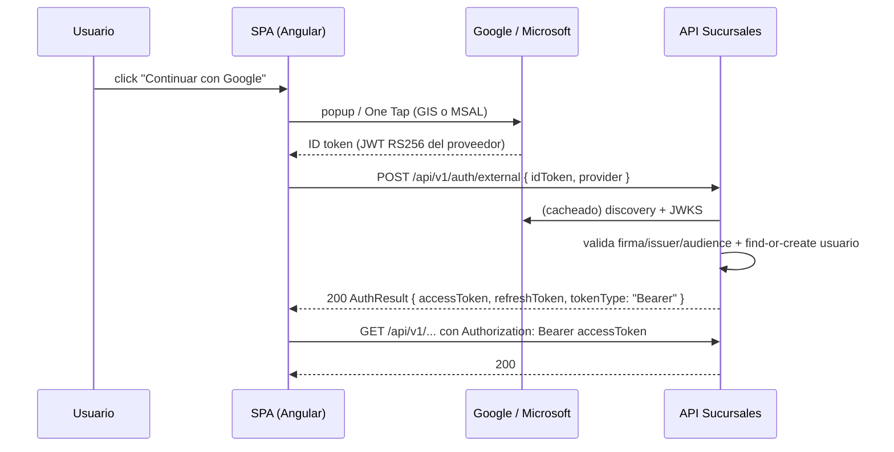

# Runbook — SPA Angular 21 con login social contra la API Sucursales

Paso a paso para levantar una SPA Angular 21 que se loguea con Google/Microsoft y consume esta API
autenticada. Complementa [authentication-guide.md](authentication-guide.md) (contrato de los
endpoints) y [auth-jwt-integration-proposal.md](auth-jwt-integration-proposal.md) (diseño).

## Cómo funciona el flujo (leer antes de empezar)

La API **no redirige** a ningún proveedor ni participa del OAuth del front. La SPA obtiene el
**ID token** del proveedor (Google Identity Services o MSAL), se lo manda a la API, y la API lo
valida contra el JWKS del proveedor y emite **su propio** par access + refresh:



Regla de oro: **el `ClientId` configurado en la API debe ser exactamente el mismo que usa la SPA**
(la API valida que el `aud` del ID token sea ese ClientId). Si difieren → `401`.

## 1. Prerrequisitos

- Node.js LTS (≥ 20) y Angular CLI 21: `npm i -g @angular/cli@21`
- .NET 10 SDK y la API corriendo local (`dotnet run --project src/Web` → `https://localhost:5001`)
- Acceso a Google Cloud Console y/o a Microsoft Entra ID (según proveedores que quieras habilitar)

## 2. Registrar la aplicación en el proveedor

### 2.1 Google

1. [console.cloud.google.com](https://console.cloud.google.com) → **APIs & Services → OAuth consent
   screen**: configurá la pantalla de consentimiento (tipo *External*, scopes `openid`, `email`,
   `profile`).
2. **Credentials → Create credentials → OAuth client ID** → tipo **Web application**.
3. En **Authorized JavaScript origins** agregá `http://localhost:4200` (y la URL real de la SPA
   cuando exista). Para el botón/One Tap de GIS **no hace falta redirect URI**.
4. Copiá el **Client ID** (`xxxx.apps.googleusercontent.com`). Los cambios de origins pueden tardar
   unos minutos en propagar.

### 2.2 Microsoft

1. [entra.microsoft.com](https://entra.microsoft.com) → **App registrations → New registration**.
2. **Supported account types**: multi-tenant (o multi-tenant + personal) funciona con el authority
   `/common/v2.0` que ya usa la API. Si registrás **single-tenant**, cambiá también el authority de
   la API a `https://login.microsoftonline.com/<tenant-id>/v2.0` (ver nota de issuer en
   [authentication-guide.md](authentication-guide.md)).
3. **Authentication → Add a platform → Single-page application**, redirect URI
   `http://localhost:4200` (y la URL real en prod).
4. Copiá el **Application (client) ID**.

## 3. Configurar la API

### 3.1 Local (user secrets — no se comitea)

```powershell
cd src/Web
dotnet user-secrets set "ExternalAuth:Providers:google:ClientId" "<client-id>.apps.googleusercontent.com"
dotnet user-secrets set "ExternalAuth:Providers:microsoft:ClientId" "<application-client-id>"
dotnet user-secrets list   # verificar
```

Alternativa por variable de entorno (misma clave con `__`):
`$env:ExternalAuth__Providers__google__ClientId = "<client-id>"` antes de `dotnet run`.

Sin ClientId el endpoint devuelve `401` y loguea `Proveedor externo '<provider>' no configurado`.

### 3.2 Azure (azd)

Las variables viven en el **environment local de azd** (archivo `.azure/<env>/.env` del repo, no
en Azure) y se aplican al **próximo provision**, que las publica como app settings del App Service:

```powershell
azd env list                                       # ver el environment activo (o azd env new <nombre>)
azd env set EXTERNAL_AUTH_GOOGLE_CLIENT_ID "<client-id>.apps.googleusercontent.com"
azd env set EXTERNAL_AUTH_MICROSOFT_CLIENT_ID "<application-client-id>"
azd env get-values | Select-String EXTERNAL        # verificar
azd provision                                      # aplica los app settings (o azd up)
```

> `azd env set` **no** afecta a `dotnet run` local: para desarrollo local usá user secrets (3.1).

### 3.3 CORS — solo si la SPA llama a la API desde otro origen sin proxy

La API **hoy no tiene CORS configurado**. En local no hace falta: el dev-server de Angular
proxea `/api` (paso 5.2) y el browser ve un solo origen. Para un deploy real con la SPA en otro
dominio, agregar en `AddWebServices` ([DependencyInjection.cs](../src/Web/DependencyInjection.cs)):

```csharp
builder.Services.AddCors(options => options.AddPolicy("Spa", policy => policy
    .WithOrigins(builder.Configuration.GetSection("Cors:AllowedOrigins").Get<string[]>() ?? [])
    .AllowAnyHeader()
    .WithMethods("GET", "POST", "PUT", "PATCH", "DELETE")));
```

y en `Program.cs`: `app.UseCors("Spa");` antes de `UseAuthentication`. Orígenes **explícitos** por
config (nunca `AllowAnyOrigin`); no hace falta `AllowCredentials` porque el token viaja por header,
no por cookie.

## 4. Crear la SPA

```powershell
ng new sucursales-spa --style=scss
cd sucursales-spa
npm i @azure/msal-browser        # solo si habilitás Microsoft
```

`src/environments/environment.development.ts` (y su par de prod con la URL real):

```ts
export const environment = {
  apiBaseUrl: '/api', // en dev pega contra el proxy (5.2); en prod, la URL de la API
  googleClientId: '<client-id>.apps.googleusercontent.com',
  microsoftClientId: '<application-client-id>',
};
```

## 5. Autenticación en la SPA

### 5.1 `AuthService` — llama a `/auth/external`, guarda el par y refresca con rotación

`src/app/auth/auth.service.ts`:

```ts
import { HttpClient } from '@angular/common/http';
import { Injectable, computed, inject, signal } from '@angular/core';
import { firstValueFrom } from 'rxjs';
import { environment } from '../../environments/environment';

/** Respuesta de /auth/login, /auth/external y /auth/refresh. */
export interface AuthResult {
  accessToken: string;
  accessTokenExpiresAtUtc: string;
  refreshToken: string;
  refreshTokenExpiresAtUtc: string;
  tokenType: string; // "Bearer"
}

const STORAGE_KEY = 'sucursales.auth';

@Injectable({ providedIn: 'root' })
export class AuthService {
  private readonly http = inject(HttpClient);
  private readonly base = `${environment.apiBaseUrl}/v1/auth`;

  private readonly auth = signal<AuthResult | null>(readStored());
  readonly isLoggedIn = computed(() => this.auth() !== null);
  readonly accessToken = computed(() => this.auth()?.accessToken ?? null);

  private refreshInFlight: Promise<boolean> | null = null;

  async loginExternal(idToken: string, provider: 'google' | 'microsoft'): Promise<void> {
    const result = await firstValueFrom(
      this.http.post<AuthResult>(`${this.base}/external`, { idToken, provider }));
    this.store(result);
  }

  /** Un solo refresh en vuelo: el refresh de la API es de UN uso (rotación), un segundo
   *  intento concurrente con el mismo token daría 401. */
  refresh(): Promise<boolean> {
    this.refreshInFlight ??= (async () => {
      const current = this.auth();
      if (!current) return false;
      try {
        const result = await firstValueFrom(this.http.post<AuthResult>(
          `${this.base}/refresh`, { refreshToken: current.refreshToken }));
        this.store(result);
        return true;
      } catch {
        this.logout();
        return false;
      } finally {
        this.refreshInFlight = null;
      }
    })();
    return this.refreshInFlight;
  }

  logout(): void {
    this.auth.set(null);
    sessionStorage.removeItem(STORAGE_KEY);
  }

  private store(result: AuthResult): void {
    this.auth.set(result);
    // sessionStorage sobrevive al F5 pero no a cerrar la pestaña. Cualquier storage del browser
    // es legible por XSS: mantené la CSP de la SPA estricta y las dependencias al día.
    sessionStorage.setItem(STORAGE_KEY, JSON.stringify(result));
  }
}

function readStored(): AuthResult | null {
  try { return JSON.parse(sessionStorage.getItem(STORAGE_KEY) ?? 'null'); } catch { return null; }
}
```

### 5.2 Proxy de desarrollo (evita CORS en local)

`proxy.conf.json` en la raíz de la SPA (`secure: false` porque el certificado local de la API es
de desarrollo):

```json
{
  "/api": {
    "target": "https://localhost:5001",
    "secure": false,
    "changeOrigin": true
  }
}
```

En `angular.json` → `projects.<app>.architect.serve.options`: `"proxyConfig": "proxy.conf.json"`
(o `ng serve --proxy-config proxy.conf.json`).

### 5.3 Interceptor — Bearer + headers de auditoría + retry con refresh ante 401

`src/app/auth/auth.interceptor.ts`, registrado en `app.config.ts` con
`provideHttpClient(withInterceptors([authInterceptor]))`:

```ts
import { HttpErrorResponse, HttpInterceptorFn, HttpRequest } from '@angular/common/http';
import { inject } from '@angular/core';
import { catchError, from, switchMap, throwError } from 'rxjs';
import { AuthService } from './auth.service';

export const authInterceptor: HttpInterceptorFn = (req, next) => {
  const auth = inject(AuthService);

  const decorate = (r: HttpRequest<unknown>) => {
    // X-* son opcionales para la API, pero alimentan su auditoría/correlación.
    let headers = r.headers
      .set('X-Application', 'sucursales-spa')
      .set('X-Channel', 'web')
      .set('X-Correlation-ID', crypto.randomUUID());
    const token = auth.accessToken();
    if (token && !r.url.includes('/auth/')) {
      headers = headers.set('Authorization', `Bearer ${token}`);
    }
    return r.clone({ headers });
  };

  return next(decorate(req)).pipe(
    catchError((err: HttpErrorResponse) => {
      // 401 en endpoint protegido → un único intento de refresh y reintento del request.
      if (err.status !== 401 || req.url.includes('/auth/')) return throwError(() => err);
      return from(auth.refresh()).pipe(
        switchMap(ok => (ok ? next(decorate(req)) : throwError(() => err))));
    }));
};
```

### 5.4 Botón de Google (Google Identity Services)

`src/app/auth/gsi-loader.ts` — carga el script una sola vez:

```ts
let gsi: Promise<void> | null = null;

export function loadGsi(): Promise<void> {
  gsi ??= new Promise((resolve, reject) => {
    const s = document.createElement('script');
    s.src = 'https://accounts.google.com/gsi/client';
    s.async = true;
    s.onload = () => resolve();
    s.onerror = () => reject(new Error('No se pudo cargar Google Identity Services'));
    document.head.appendChild(s);
  });
  return gsi;
}
```

`src/app/auth/google-button.component.ts`:

```ts
import { AfterViewInit, Component, ElementRef, NgZone, inject, viewChild } from '@angular/core';
import { Router } from '@angular/router';
import { environment } from '../../environments/environment';
import { AuthService } from './auth.service';
import { loadGsi } from './gsi-loader';

declare const google: any;

@Component({
  selector: 'app-google-button',
  template: `<div #container></div>`,
})
export class GoogleButtonComponent implements AfterViewInit {
  private readonly auth = inject(AuthService);
  private readonly router = inject(Router);
  private readonly zone = inject(NgZone); // el callback de GIS llega fuera de Angular
  private readonly container = viewChild.required<ElementRef<HTMLDivElement>>('container');

  async ngAfterViewInit(): Promise<void> {
    await loadGsi();
    google.accounts.id.initialize({
      client_id: environment.googleClientId,
      callback: (resp: { credential: string }) =>
        this.zone.run(() => this.onIdToken(resp.credential)),
    });
    google.accounts.id.renderButton(this.container().nativeElement,
      { theme: 'outline', size: 'large', text: 'continue_with' });
  }

  private async onIdToken(idToken: string): Promise<void> {
    await this.auth.loginExternal(idToken, 'google'); // resp.credential ES el ID token
    await this.router.navigateByUrl('/');
  }
}
```

### 5.5 Botón de Microsoft (MSAL)

```ts
import { PublicClientApplication } from '@azure/msal-browser';
import { environment } from '../../environments/environment';

const msal = new PublicClientApplication({
  auth: {
    clientId: environment.microsoftClientId,
    authority: 'https://login.microsoftonline.com/common',
    redirectUri: window.location.origin,
  },
});

/** Devuelve el ID token para POSTear a /auth/external con provider: 'microsoft'. */
export async function loginMicrosoft(): Promise<string> {
  await msal.initialize();
  const result = await msal.loginPopup({ scopes: ['openid', 'profile', 'email'] });
  return result.idToken;
}
```

> Mandá `result.idToken` (NO `result.accessToken`): la API valida el **ID token** y espera
> `aud = ClientId`. El access token de MS tiene otra audience y da `401`.

### 5.6 Guard para rutas protegidas

```ts
import { inject } from '@angular/core';
import { CanActivateFn, Router } from '@angular/router';
import { AuthService } from './auth.service';

export const authGuard: CanActivateFn = () => {
  const auth = inject(AuthService);
  return auth.isLoggedIn() ? true : inject(Router).createUrlTree(['/login']);
};
```

En `app.routes.ts`: `{ path: '', component: HomeComponent, canActivate: [authGuard] }` y una ruta
`/login` con los botones de 5.4/5.5.

## 6. Prueba end-to-end (checklist)

1. **API arriba con ClientId cargado**: `dotnet run --project src/Web` (tras el paso 3.1).
2. **Sin token da 401** (confirma que el endpoint está protegido):
   `curl -k https://localhost:5001/api/v1/provincias` → `401`.
3. **SPA arriba**: `ng serve` → `http://localhost:4200/login` → botón de Google.
4. En la pestaña **Network**: `POST /api/v1/auth/external` → `200` con
   `{ accessToken, refreshToken, tokenType: "Bearer", ... }`.
5. Navegar a una vista que llame `GET /api/v1/provincias` → `200` con el header
   `Authorization: Bearer <accessToken>` visible en el request.
6. **Refresh con rotación**: repetir un request con el access vencido (o borrar solo el
   `accessToken` del sessionStorage) → el interceptor hace `POST /auth/refresh` → `200` y el
   `refreshToken` cambia (el viejo queda revocado: reusarlo da `401`).
7. En la base: el usuario social queda creado y verificado (`EMAIL_VERIFIED_AT` no nulo).

## 7. Troubleshooting

| Síntoma | Causa probable | Solución |
| --- | --- | --- |
| `401` en `/auth/external` y log `Proveedor externo '...' no configurado` | Falta `ClientId` en la API | Paso 3.1 / 3.2 |
| `401` y log con `IDX10214` (audience) | El ClientId de la API ≠ el de la SPA, o mandaste el access token de MS en vez del ID token | Unificar ClientId; usar `result.idToken` |
| `401` y log con issuer inválido | Registro single-tenant con authority `/common` (o viceversa) | Alinear authority ↔ tipo de registro (paso 2.2) |
| `401` `El proveedor no confirmó un email válido` | La cuenta del proveedor no tiene email verificado (`email_verified=false`) | Probar con otra cuenta; es un rechazo deliberado |
| Error CORS en la consola del browser | SPA llamando a la API cross-origin sin proxy ni CORS | Proxy en dev (5.2) o CORS en la API (3.3) |
| El botón de Google no aparece / `origin_mismatch` | `http://localhost:4200` no está en Authorized JavaScript origins (o aún no propagó) | Paso 2.1; esperar unos minutos |
| Popup de MSAL bloqueado | Bloqueador de popups | Disparar `loginPopup` desde un click directo del usuario |
| `401` esporádico recién emitido el ID token | Clock skew del equipo | Sincronizar hora; la validación tolera 5 min |
| `502/504` del proxy de Angular | La API no corre en `https://localhost:5001` o el target del proxy no coincide | Ajustar `proxy.conf.json` |

## 8. Referencia rápida: `azd env set` en local

- `azd env set CLAVE valor` escribe en `.azure/<environment>/.env` de tu máquina — es config
  **local del deploy**, no de la app corriendo local ni del portal de Azure.
- Se necesita un environment: `azd env list` muestra el activo; si no hay, `azd env new <nombre>`
  (o el que crea `azd up` la primera vez). Con varios: `azd env set CLAVE valor -e <nombre>`.
- Verificás con `azd env get-values`.
- Surte efecto recién en el próximo `azd provision` / `azd up`: ahí
  [main.parameters.json](../infra/main.parameters.json) toma `${EXTERNAL_AUTH_GOOGLE_CLIENT_ID=}`
  y el bicep lo publica como app setting `ExternalAuth__Providers__google__ClientId` del App
  Service (vacío = no se publica y el proveedor queda deshabilitado).
- En CI (GitHub Actions) el environment se reconstruye: pasá estas variables vía
  `azd pipeline config` / `AZD_INITIAL_ENVIRONMENT_CONFIG`, no dependas del `.azure/` local.
- Para `dotnet run` local **no** sirve: usá user secrets (paso 3.1).
